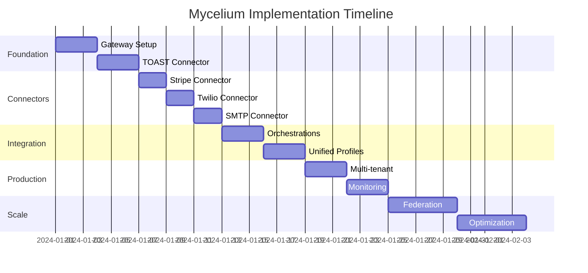

# Mycelium GraphQL Implementation Guide: From VinoVoyage to Restaurant Platform

## Executive Summary

This document outlines the complete implementation plan for building Mycelium as a GraphQL federation platform, starting with the VinoVoyage engagement and scaling to a multi-tenant restaurant SaaS platform. The approach prioritizes IP ownership over vendor dependency, creating both immediate revenue and long-term platform value.

---

## Strategic Decision: Build vs Buy Analysis

### **The Hasura Question: Should We Use It?**

**Answer: No - Build our own GraphQL gateway for maximum value creation.**

| Decision Factor | Use Hasura | Build Own Gateway | Winner |
|----------------|------------|-------------------|---------|
| **Development Speed** | 2 weeks faster | 4-6 weeks total | Hasura (short-term) |
| **IP Ownership** | Low (platform dependency) | High (own the stack) | **Build Own** |
| **Long-term Control** | Limited (vendor roadmap) | Full (our architecture) | **Build Own** |
| **Business Model** | Pay Hasura forever | Own and monetize | **Build Own** |
| **VinoVoyage Fit** | Generic database API | Restaurant-specific workflows | **Build Own** |

### **The Strategic Reality**

```yaml
VinoVoyage Actually Needs:
  - TOAST POS integration (order data)
  - Stripe payment processing
  - Twilio SMS notifications  
  - SMTP email campaigns
  - Guest profile unification
  - Business workflow automation
  
Hasura Provides:
  - Database GraphQL APIs
  - Real-time subscriptions
  - Generic CRUD operations
  
The Gap:
  - No restaurant-specific connectors
  - No business workflow orchestration
  - No domain expertise
  - No competitive moat for us
```

### **The Opportunity**

By building our own GraphQL federation platform:

1. **VinoVoyage pays for development** ($15K/month × 4 months = $60K)
2. **We own the entire platform** (IP value: $1-5M)
3. **Extract to Mycelium SaaS** ($299/month × 100 restaurants = $358K ARR)
4. **Build competitive moat** (restaurant-specific workflows)

---

## Implementation Plan: 4 Weeks to Production

### **Phase 1: Foundation (Week 1)**

#### **Day 1-3: Core Gateway Setup**

```typescript
// Project Structure
mycelium/
├── gateway/                 # Apollo Federation Gateway
│   ├── src/
│   │   ├── index.ts        # Main server
│   │   ├── context.ts      # Request context
│   │   └── auth.ts         # Multi-tenant auth
├── connectors/             # Subgraph connectors
│   ├── toast/              # POS integration
│   ├── stripe/             # Payment processing
│   ├── twilio/             # SMS service
│   └── smtp/               # Email service
├── shared/                 # Common utilities
│   ├── types/              # TypeScript definitions
│   ├── vault/              # Credential management
│   └── monitoring/         # Observability
└── docker-compose.yml
```

```typescript
// gateway/src/index.ts - The Federation Core
import { ApolloGateway, IntrospectAndCompose } from '@apollo/gateway';
import { ApolloServer } from '@apollo/server';

const gateway = new ApolloGateway({
  supergraphSdl: new IntrospectAndCompose({
    subgraphs: [
      { name: 'toast', url: 'http://localhost:4001/graphql' },
      { name: 'stripe', url: 'http://localhost:4002/graphql' },
      { name: 'twilio', url: 'http://localhost:4003/graphql' },
      { name: 'smtp', url: 'http://localhost:4004/graphql' },
    ],
  }),
});

const server = new ApolloServer({
  gateway,
  context: ({ req }) => ({
    tenant: getTenantFromAuth(req.headers.authorization),
    vault: new CredentialVault(req.headers.authorization),
  }),
});
```

#### **Day 4-6: TOAST Connector**

```typescript
// connectors/toast/src/schema.ts
export const typeDefs = gql`
  extend schema @link(url: "https://specs.apollo.dev/federation/v2.0")
  
  type Query {
    toast: ToastAPI
  }
  
  type ToastAPI {
    # Core restaurant operations
    orders(status: OrderStatus, limit: Int = 20): [Order!]!
    order(id: ID!): Order
    searchGuests(query: String!): [Guest!]!
    guest(id: ID!): Guest
    
    # Restaurant management
    tables: [Table!]!
    menu: Menu!
    staff: [Staff!]!
  }
  
  type Order @key(fields: "id") {
    id: ID!
    toastGuid: String!        # TOAST's internal ID
    items: [OrderItem!]!
    guest: Guest
    table: Table
    server: Staff
    
    # Financial details
    subtotal: Float!
    tax: Float!
    tip: Float
    total: Float!
    
    # Order lifecycle
    status: OrderStatus!
    openedAt: DateTime!
    closedAt: DateTime
    
    # Federation keys for payment linkage
    paymentId: ID             # Links to Stripe payment
  }
  
  type Guest @key(fields: "email") @key(fields: "phone") {
    email: String
    phone: String
    toastId: ID!
    name: String
    visitCount: Int!
    lifetimeValue: Float!
    lastVisit: DateTime
    preferences: JSON         # Wine preferences, dietary restrictions
  }
  
  type OrderItem {
    name: String!
    quantity: Int!
    price: Float!
    modifiers: [String!]      # Extra sauce, no onions, etc.
    category: String!         # Food, Wine, Beverage
    isAlcohol: Boolean!
  }
  
  enum OrderStatus {
    OPEN
    CLOSED
    PAID
    VOIDED
  }
`;

// connectors/toast/src/resolvers.ts
export const resolvers = {
  Query: {
    toast: () => ({}), // Namespace resolver
  },
  ToastAPI: {
    orders: async (_, args, context) => {
      const { restaurantGuid, apiKey } = await context.vault.getToastCredentials();
      return toastClient.getOrders(restaurantGuid, apiKey, args);
    },
    order: async (_, { id }, context) => {
      const creds = await context.vault.getToastCredentials();
      return toastClient.getOrder(id, creds);
    },
    searchGuests: async (_, { query }, context) => {
      const creds = await context.vault.getToastCredentials();
      return toastClient.searchGuests(query, creds);
    },
  },
  Order: {
    __resolveReference: async (reference, context) => {
      const creds = await context.vault.getToastCredentials();
      return toastClient.getOrder(reference.id, creds);
    },
    guest: async (order, _, context) => {
      if (!order.guestId) return null;
      const creds = await context.vault.getToastCredentials();
      return toastClient.getGuest(order.guestId, creds);
    },
  },
  Guest: {
    __resolveReference: async (reference, context) => {
      const creds = await context.vault.getToastCredentials();
      if (reference.email) {
        return toastClient.findGuestByEmail(reference.email, creds);
      }
      if (reference.phone) {
        return toastClient.findGuestByPhone(reference.phone, creds);
      }
      return null;
    },
  },
};
```

### **Phase 2: Complete Core Connectors (Week 2)**

#### **Day 7-8: Stripe Connector**

```typescript
// connectors/stripe/src/schema.ts
export const typeDefs = gql`
  extend schema @link(url: "https://specs.apollo.dev/federation/v2.0")
  
  type Query {
    stripe: StripeAPI
  }
  
  type StripeAPI {
    # Customer management
    customers(email: String, limit: Int = 20): [Customer!]!
    customer(id: ID!): Customer
    
    # Payment operations
    payments(limit: Int = 20): [Payment!]!
    payment(id: ID!): Payment
    
    # Wine club subscriptions
    subscriptions(status: SubscriptionStatus): [Subscription!]!
  }
  
  type Payment @key(fields: "id") {
    id: ID!
    amount: Int!              # Amount in cents
    currency: String!
    status: PaymentStatus!
    customer: Customer
    paymentMethod: PaymentMethod
    
    # Link to TOAST order
    metadata: JSON            # Contains orderId, toastGuid
    orderId: ID               # Extracted from metadata
    
    created: DateTime!
    updated: DateTime!
  }
  
  type Customer @key(fields: "id") @key(fields: "email") {
    id: ID!
    email: String
    name: String
    phone: String
    defaultPaymentMethod: PaymentMethod
    paymentMethods: [PaymentMethod!]!
    subscriptions: [Subscription!]!
  }
  
  # Extend TOAST Guest with Stripe data
  extend type Guest @key(fields: "email") {
    email: String! @external
    stripeCustomer: Customer
    paymentMethods: [PaymentMethod!]!
    activeSubscriptions: [Subscription!]!
    totalSpent: Float!        # Lifetime payment value
  }
  
  type PaymentMethod {
    id: ID!
    type: PaymentMethodType!
    card: CardDetails
    isDefault: Boolean!
  }
  
  type CardDetails {
    brand: String!            # visa, mastercard, amex
    last4: String!
    expMonth: Int!
    expYear: Int!
    country: String
  }
  
  type Subscription {
    id: ID!
    status: SubscriptionStatus!
    items: [SubscriptionItem!]!
    currentPeriodStart: DateTime!
    currentPeriodEnd: DateTime!
  }
  
  enum PaymentStatus {
    REQUIRES_PAYMENT_METHOD
    REQUIRES_CONFIRMATION
    REQUIRES_ACTION
    PROCESSING
    SUCCEEDED
    REQUIRES_CAPTURE
    CANCELED
  }
`;

// connectors/stripe/src/resolvers.ts
export const resolvers = {
  Query: {
    stripe: () => ({}),
  },
  StripeAPI: {
    customers: async (_, { email, limit }, context) => {
      const { secretKey } = await context.vault.getStripeCredentials();
      const stripe = new Stripe(secretKey);
      
      const customers = await stripe.customers.list({
        email,
        limit,
      });
      return customers.data;
    },
    payment: async (_, { id }, context) => {
      const { secretKey } = await context.vault.getStripeCredentials();
      const stripe = new Stripe(secretKey);
      return await stripe.paymentIntents.retrieve(id);
    },
  },
  Guest: {
    stripeCustomer: async (guest, _, context) => {
      if (!guest.email) return null;
      
      const { secretKey } = await context.vault.getStripeCredentials();
      const stripe = new Stripe(secretKey);
      
      const customers = await stripe.customers.list({
        email: guest.email,
        limit: 1,
      });
      return customers.data[0] || null;
    },
    paymentMethods: async (guest, _, context) => {
      const stripeCustomer = await resolvers.Guest.stripeCustomer(guest, _, context);
      if (!stripeCustomer) return [];
      
      const { secretKey } = await context.vault.getStripeCredentials();
      const stripe = new Stripe(secretKey);
      
      const paymentMethods = await stripe.paymentMethods.list({
        customer: stripeCustomer.id,
        type: 'card',
      });
      return paymentMethods.data;
    },
  },
  Payment: {
    __resolveReference: async (reference, context) => {
      const { secretKey } = await context.vault.getStripeCredentials();
      const stripe = new Stripe(secretKey);
      return await stripe.paymentIntents.retrieve(reference.id);
    },
    orderId: (payment) => {
      return payment.metadata?.orderId || null;
    },
  },
};
```

#### **Day 9-10: Twilio Connector**

```typescript
// connectors/twilio/src/schema.ts
export const typeDefs = gql`
  extend schema @link(url: "https://specs.apollo.dev/federation/v2.0")
  
  type Query {
    twilio: TwilioAPI
  }
  
  type Mutation {
    sendSMS(to: String!, message: String!, mediaUrl: String): Message!
    sendBulkSMS(recipients: [String!]!, message: String!): [Message!]!
  }
  
  type TwilioAPI {
    # Message history
    messages(to: String, from: String, limit: Int = 20): [Message!]!
    message(sid: String!): Message
    
    # Phone number validation
    lookupPhone(number: String!): PhoneLookup
  }
  
  type Message {
    sid: String!
    to: String!
    from: String!
    body: String!
    status: MessageStatus!
    direction: MessageDirection!
    price: Float
    errorCode: String
    errorMessage: String
    dateSent: DateTime!
    dateUpdated: DateTime!
  }
  
  # Extend Guest with SMS capabilities
  extend type Guest @key(fields: "phone") {
    phone: String! @external
    phoneVerified: Boolean
    phoneType: PhoneType
    smsOptIn: Boolean
    lastSMS: Message
    smsHistory(limit: Int = 10): [Message!]!
  }
  
  type PhoneLookup {
    valid: Boolean!
    phoneNumber: String!        # E.164 format
    nationalFormat: String!     # (555) 123-4567
    carrier: String
    type: PhoneType!
  }
  
  enum MessageStatus {
    ACCEPTED
    QUEUED
    SENDING
    SENT
    FAILED
    DELIVERED
    UNDELIVERED
    RECEIVING
    RECEIVED
    READ
  }
  
  enum MessageDirection {
    INBOUND
    OUTBOUND_API
    OUTBOUND_CALL
    OUTBOUND_REPLY
  }
  
  enum PhoneType {
    LANDLINE
    MOBILE
    VOIP
  }
`;

// connectors/twilio/src/mutations.ts
export const mutations = {
  Mutation: {
    sendSMS: async (_, { to, message, mediaUrl }, context) => {
      const { accountSid, authToken, fromNumber } = 
        await context.vault.getTwilioCredentials();
      
      const client = twilio(accountSid, authToken);
      
      try {
        const sms = await client.messages.create({
          body: message,
          from: fromNumber,
          to: to,
          mediaUrl: mediaUrl ? [mediaUrl] : undefined,
          statusCallback: `${process.env.WEBHOOK_BASE_URL}/twilio/status/${context.tenant.id}`
        });
        
        return sms;
      } catch (error) {
        logger.error('SMS send failed', { to, error: error.message });
        throw new Error(`Failed to send SMS: ${error.message}`);
      }
    },
    
    sendBulkSMS: async (_, { recipients, message }, context) => {
      const { accountSid, authToken, fromNumber } = 
        await context.vault.getTwilioCredentials();
      
      const client = twilio(accountSid, authToken);
      
      // Use rate limiter to avoid Twilio limits
      const rateLimiter = new Bottleneck({
        maxConcurrent: 1,
        minTime: 1000, // 1 second between requests
      });
      
      const results = await Promise.allSettled(
        recipients.map(to => 
          rateLimiter.schedule(() => 
            client.messages.create({
              body: message,
              from: fromNumber,
              to: to,
              statusCallback: `${process.env.WEBHOOK_BASE_URL}/twilio/status/${context.tenant.id}`
            })
          )
        )
      );
      
      return results
        .filter(result => result.status === 'fulfilled')
        .map(result => result.value);
    },
  },
};
```

#### **Day 11-12: SMTP Connector**

```typescript
// connectors/smtp/src/templates.ts
export const emailTemplates = {
  receipt: {
    subject: 'Your receipt from {{restaurant.name}}',
    html: `
      <!DOCTYPE html>
      <html>
        <head>
          <meta charset="utf-8">
          <title>Receipt from {{restaurant.name}}</title>
        </head>
        <body style="font-family: Arial, sans-serif; line-height: 1.6; color: #333;">
          <div style="max-width: 600px; margin: 0 auto; padding: 20px;">
            <h2 style="color: #2c3e50;">Thank you for dining with us!</h2>
            
            <div style="background: #f8f9fa; padding: 15px; border-radius: 5px; margin: 20px 0;">
              <h3>Order #{{order.id}}</h3>
              <p><strong>Date:</strong> {{formatDate order.closedAt}}</p>
              <p><strong>Server:</strong> {{order.server.name}}</p>
              {{#if order.table}}
              <p><strong>Table:</strong> {{order.table.name}}</p>
              {{/if}}
            </div>
            
            <table style="width: 100%; border-collapse: collapse; margin: 20px 0;">
              <thead>
                <tr style="background: #34495e; color: white;">
                  <th style="padding: 10px; text-align: left;">Item</th>
                  <th style="padding: 10px; text-align: center;">Qty</th>
                  <th style="padding: 10px; text-align: right;">Price</th>
                </tr>
              </thead>
              <tbody>
                {{#each order.items}}
                <tr style="border-bottom: 1px solid #ddd;">
                  <td style="padding: 10px;">
                    {{name}}
                    {{#if modifiers}}
                    <br><small style="color: #666;">{{join modifiers ", "}}</small>
                    {{/if}}
                  </td>
                  <td style="padding: 10px; text-align: center;">{{quantity}}</td>
                  <td style="padding: 10px; text-align: right;">${{formatCurrency price}}</td>
                </tr>
                {{/each}}
              </tbody>
            </table>
            
            <div style="border-top: 2px solid #34495e; padding-top: 15px; text-align: right;">
              <p><strong>Subtotal: ${{formatCurrency order.subtotal}}</strong></p>
              <p><strong>Tax: ${{formatCurrency order.tax}}</strong></p>
              {{#if order.tip}}
              <p><strong>Tip: ${{formatCurrency order.tip}}</strong></p>
              {{/if}}
              <p style="font-size: 18px; color: #27ae60;">
                <strong>Total: ${{formatCurrency order.total}}</strong>
              </p>
            </div>
            
            <div style="text-align: center; margin-top: 30px; padding-top: 20px; border-top: 1px solid #ddd;">
              <p>Thank you for choosing {{restaurant.name}}!</p>
              <p style="color: #666; font-size: 14px;">
                Questions about your order? Reply to this email or call {{restaurant.phone}}
              </p>
            </div>
          </div>
        </body>
      </html>
    `
  },
  reservation: {
    subject: 'Reservation confirmed for {{formatDate date "MMM Do"}} at {{restaurant.name}}',
    html: `...`
  },
  marketing: {
    subject: 'Special wine pairing dinner this Friday',
    html: `...`
  }
};

// connectors/smtp/src/sender.ts
export const sendEmail = async (input: EmailInput, context: Context) => {
  const smtp = await context.vault.getSMTPConfig();
  
  // Support multiple providers
  if (smtp.provider === 'sendgrid') {
    return sendViaSendGrid(input, smtp.apiKey);
  } else if (smtp.provider === 'ses') {
    return sendViaSES(input, smtp.config);
  } else {
    // Generic SMTP
    return sendViaSMTP(input, smtp);
  }
};
```

### **Phase 3: Orchestration & Intelligence (Week 3)**

#### **Day 13-15: Business Workflows**

```typescript
// gateway/src/orchestrations/dinner-service.ts
export const completeDinnerService = {
  typeDef: gql`
    extend type Mutation {
      completeDinnerService(
        orderId: ID!
        tip: Float
        sendReceipt: Boolean = true
        receiptMethod: ReceiptMethod = EMAIL
      ): DinnerServiceResult!
    }
    
    type DinnerServiceResult {
      order: Order!
      payment: Payment!
      notifications: [NotificationResult!]!
      loyaltyPointsEarned: Int
      success: Boolean!
      errors: [String!]
    }
    
    type NotificationResult {
      type: NotificationType!
      status: NotificationStatus!
      messageId: String
      error: String
    }
    
    enum ReceiptMethod {
      EMAIL
      SMS
      BOTH
    }
    
    enum NotificationType {
      SMS
      EMAIL
      PUSH
    }
    
    enum NotificationStatus {
      SENT
      DELIVERED
      FAILED
      PENDING
    }
  `,

  resolver: async (_, { orderId, tip, sendReceipt, receiptMethod }, context) => {
    const errors: string[] = [];
    const notifications: NotificationResult[] = [];
    
    try {
      // 1. Close order in TOAST with tip
      const order = await context.dataSources.toast.closeOrder(orderId, tip);

      // 2. Process payment via Stripe
      const payment = await context.dataSources.stripe.createPaymentIntent({
        amount: Math.round(order.total * 100),
        customer: order.guest.stripeCustomerId,
        metadata: { orderId, toastGuid: order.toastGuid }
      });

      // 3. Send notifications based on guest preference
      if (sendReceipt && order.guest) {
        const method = receiptMethod === 'BOTH' ? 
          ['EMAIL', 'SMS'] : [receiptMethod];
          
        // Send email receipt
        if (method.includes('EMAIL') && order.guest.email) {
          try {
            const emailResult = await context.dataSources.smtp.sendEmail({
              to: [order.guest.email],
              template: 'receipt',
              variables: { order, payment, guest: order.guest }
            });
            
            notifications.push({
              type: 'EMAIL',
              status: 'SENT',
              messageId: emailResult.messageId
            });
          } catch (error) {
            errors.push(`Email receipt failed: ${error.message}`);
          }
        }
        
        // Send SMS receipt
        if (method.includes('SMS') && order.guest.phone) {
          try {
            const smsResult = await context.dataSources.twilio.sendSMS({
              to: order.guest.phone,
              message: `Thanks for dining! Your receipt: ${process.env.RECEIPT_URL}/${payment.id}`
            });
            
            notifications.push({
              type: 'SMS',
              status: 'SENT',
              messageId: smsResult.sid
            });
          } catch (error) {
            errors.push(`SMS receipt failed: ${error.message}`);
          }
        }
      }

      // 4. Update loyalty points
      const points = Math.floor(order.total);
      await updateGuestLoyalty(order.guest.id, points, context);

      return {
        order,
        payment,
        notifications,
        loyaltyPointsEarned: points,
        success: errors.length === 0,
        errors
      };

    } catch (error) {
      logger.error('Dinner service completion failed', { orderId, error: error.message });
      
      return {
        order: null,
        payment: null,
        notifications,
        loyaltyPointsEarned: 0,
        success: false,
        errors: [error.message, ...errors]
      };
    }
  }
};
```

#### **Day 16-18: Unified Guest Profile**

```typescript
// gateway/src/unified/guest-profile.ts
export const unifiedGuestResolver = {
  Query: {
    unifiedGuest: async (_, { email, phone }, context) => {
      // Parallel fetch from all sources
      const [toastGuest, stripeCustomer, twilioProfile, emailStats] =
        await Promise.all([
          context.dataSources.toast.findGuest({ email, phone }),
          context.dataSources.stripe.findCustomer({ email }),
          context.dataSources.twilio.lookupPhone(phone),
          context.dataSources.smtp.getEmailStats(email)
        ]);

      // Merge and enrich
      return {
        // Identity
        email: email || toastGuest?.email || stripeCustomer?.email,
        phone: phone || toastGuest?.phone,
        name: toastGuest?.name || stripeCustomer?.name,

        // Restaurant data
        visitCount: toastGuest?.visitCount || 0,
        lifetimeValue: toastGuest?.lifetimeValue || 0,
        favoriteItems: toastGuest?.favoriteItems || [],
        lastVisit: toastGuest?.lastVisit,

        // Payment data
        stripeCustomerId: stripeCustomer?.id,
        paymentMethods: stripeCustomer?.paymentMethods || [],
        subscriptions: stripeCustomer?.subscriptions || [],

        // Communication
        phoneVerified: twilioProfile?.valid || false,
        phoneType: twilioProfile?.type,
        smsOptIn: toastGuest?.preferences?.smsOptIn || false,
        emailOptIn: toastGuest?.preferences?.emailOptIn || false,
        emailEngagement: emailStats,

        // Computed insights
        segment: computeGuestSegment(toastGuest, stripeCustomer),
        preferences: mergePreferences(toastGuest, stripeCustomer)
      };
    }
  }
};
```

### **Phase 4: Production Deployment (Week 4)**

#### **Day 19-21: Multi-Tenant & Security**

```typescript
// gateway/src/auth/multi-tenant.ts
export class TenantManager {
  async validateRequest(req: Request): Promise<Tenant> {
    const token = req.headers.authorization?.replace('Bearer ', '');
    if (!token) throw new AuthenticationError('No token provided');

    // Decode JWT or API key
    const decoded = await verifyToken(token);

    // Load tenant configuration
    const tenant = await db.tenants.findOne({ id: decoded.tenantId });
    if (!tenant) throw new ForbiddenError('Invalid tenant');

    // Check rate limits
    await rateLimiter.check(tenant.id, tenant.plan);

    return {
      id: tenant.id,
      name: tenant.name,
      plan: tenant.plan,

      // Connector configs (encrypted at rest)
      connectors: {
        toast: await vault.decrypt(tenant.toastConfig),
        stripe: await vault.decrypt(tenant.stripeConfig),
        twilio: await vault.decrypt(tenant.twilioConfig),
        smtp: await vault.decrypt(tenant.smtpConfig)
      }
    };
  }
}
```

#### **Day 22-24: Monitoring & Observability**

```typescript
// gateway/src/monitoring/index.ts
import { PrometheusExporter } from '@opentelemetry/exporter-prometheus';
import { ApolloServerPlugin } from '@apollo/server';

export const monitoringPlugin: ApolloServerPlugin = {
  async requestDidStart() {
    const start = Date.now();

    return {
      async willSendResponse(context) {
        // Track metrics
        metrics.histogram('graphql.request.duration', Date.now() - start, {
          operation: context.operationName,
          tenant: context.contextValue.tenant.id,
          success: !context.errors?.length
        });

        // Track connector usage
        if (context.operationName?.includes('toast')) {
          metrics.increment('connector.toast.calls', {
            tenant: context.contextValue.tenant.id
          });
        }
      },

      async didEncounterErrors(context) {
        // Log errors with context
        logger.error('GraphQL Error', {
          errors: context.errors,
          operation: context.operationName,
          tenant: context.contextValue.tenant.id,
          query: context.request.query
        });

        // Alert on critical errors
        if (context.errors.some(e => e.extensions?.code === 'INTERNAL_SERVER_ERROR')) {
          await alerting.send({
            severity: 'critical',
            message: 'Internal server error in GraphQL',
            tenant: context.contextValue.tenant.id
          });
        }
      }
    };
  }
};
```

### **Phase 5: Scale & Optimize (Month 2+)**

#### **Federation Architecture**

```yaml
# docker-compose.production.yml
version: '3.8'

services:
  # Load balancer
  nginx:
    image: nginx:alpine
    ports:
      - "443:443"
    volumes:
      - ./nginx.conf:/etc/nginx/nginx.conf
      - ./certs:/etc/nginx/certs
    depends_on:
      - gateway

  # Apollo Gateway (multiple instances)
  gateway:
    image: mycelium/gateway:${VERSION}
    deploy:
      replicas: 3
    environment:
      - REDIS_URL=redis://redis:6379
      - SUBGRAPH_URLS=${SUBGRAPH_URLS}
    depends_on:
      - redis
      - vault

  # Subgraphs (can scale independently)
  toast-connector:
    image: mycelium/toast:${VERSION}
    deploy:
      replicas: 2
    ports:
      - "4001"

  stripe-connector:
    image: mycelium/stripe:${VERSION}
    deploy:
      replicas: 2
    ports:
      - "4002"

  # Shared services
  redis:
    image: redis:7-alpine
    volumes:
      - redis-data:/data

  vault:
    image: hashicorp/vault:latest
    cap_add:
      - IPC_LOCK
    volumes:
      - vault-data:/vault/data

volumes:
  redis-data:
  vault-data:
```

#### **Performance Optimizations**

```typescript
// Implement DataLoader for batching
import DataLoader from 'dataloader';

const guestLoader = new DataLoader(async (emails: string[]) => {
  const guests = await toast.getGuestsByEmails(emails);
  return emails.map(email =>
    guests.find(g => g.email === email)
  );
});

// Add response caching
import { RedisCache } from 'apollo-server-cache-redis';

const server = new ApolloServer({
  cache: new RedisCache({
    client: redis,
    ttl: 300, // 5 minutes default
  }),
  plugins: [
    responseCachePlugin({
      sessionId: (context) => context.tenant.id,
      ttl: (hint) => hint.maxAge || 300,
    }),
  ],
});
```

---

## Success Metrics & KPIs

### **Technical Metrics**
- API response time: < 200ms p95
- Uptime: 99.9% SLA
- Error rate: < 0.1%
- Cache hit rate: > 80%

### **Business Metrics**
- Time to first integration: < 1 hour
- Customer onboarding: < 1 day
- Support tickets: < 5 per customer/month
- Customer retention: > 95%

### **Growth Metrics**
- New customers/month: 10+
- ARR growth: 20% MoM
- Expansion revenue: 30% of base
- NPS score: > 50

---

## Risk Mitigation

| Risk | Impact | Mitigation |
|------|--------|------------|
| TOAST API changes | High | Version pinning, change detection |
| Stripe PCI compliance | Critical | Never store card data, use tokens |
| SMS delivery issues | Medium | Multiple providers, retry logic |
| Email deliverability | Medium | Warm IPs, authentication (SPF/DKIM) |
| Credential leaks | Critical | Vault encryption, rotation, audit logs |
| Scaling bottlenecks | High | Federation ready, horizontal scaling |

---

## Timeline Summary



---

## Next Steps

1. **Week 1**: Set up basic gateway with TOAST connector
2. **Week 2**: Complete all 4 connectors
3. **Week 3**: Add orchestrations and unified profile
4. **Week 4**: Production hardening and deployment
5. **Month 2**: Optimize, scale, and add more connectors

This plan delivers a **production-ready platform** in 4 weeks that can immediately serve VinoVoyage and scale to hundreds of restaurants.

The key insight: **Build once for VinoVoyage, own forever for Mycelium.** Every line of code, every workflow, every connector becomes a reusable asset that generates recurring revenue at $299/month per restaurant.

By month 6, you'll have both a happy VinoVoyage customer AND a scalable restaurant SaaS platform generating $30K+ MRR. That's the path to $20M+ valuation.