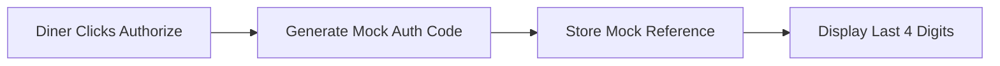
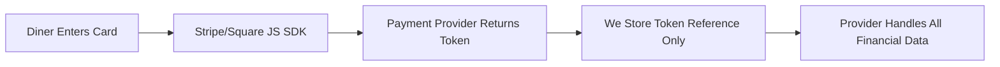

# Payment Security Architecture - No Financial Data Storage

## ❌ What We NEVER Store

### Never in Our Database:
- ❌ Credit card numbers
- ❌ CVV codes
- ❌ Full card details
- ❌ Bank account numbers
- ❌ Payment credentials

### Never in Our Code:
- ❌ Raw payment data
- ❌ Unencrypted card information
- ❌ Payment method details beyond last 4 digits

## ✅ What We DO Store

### In Demo Mode (Current Implementation):
```typescript
interface MockPaymentData {
  cardLast4: "4242",           // ✅ Last 4 digits only (for display)
  authorizationCode: "auth_xyz", // ✅ Mock reference ID
  authorizationAmount: 85,      // ✅ Dollar amount
  paymentProcessor: "mock"      // ✅ Provider name
}
```

### In Production Mode (Future with Stripe/Square):
```typescript
interface ProductionPaymentData {
  // Only tokenized references - NO actual payment data
  stripePaymentIntentId: "pi_1234567890",  // ✅ Stripe's reference
  stripeCustomerId: "cus_abc123",          // ✅ Stripe's customer ID
  cardLast4: "4242",                       // ✅ For display only
  cardBrand: "visa",                       // ✅ Card type
  authorizationAmount: 85,                  // ✅ Amount authorized
  authorizationStatus: "ACTIVE"             // ✅ Status
}
```

## 🔐 How Payment Flow Works (Without Storing Financial Data)

### Demo Mode (Current):


### Production Mode (Future):


## 🏗️ Implementation Examples

### What Gets Stored in Neo4j:
```cypher
// This is ALL we store about payments
CREATE (wt:WineTransaction {
  id: "wt_123",
  
  // Safe references only
  stripePaymentIntentId: "pi_1234567890",  // ✅ Reference to Stripe
  paymentStatus: "AUTHORIZED",              // ✅ Status string
  authorizationAmount: 85.00,               // ✅ Dollar amount
  cardLast4: "4242",                        // ✅ Display purposes
  cardBrand: "visa",                        // ✅ Card type
  
  // Never stored
  // ❌ fullCardNumber
  // ❌ cvv
  // ❌ cardholderName
  // ❌ billingAddress
})
```

### Frontend Payment Handling:
```typescript
// Customer enters card on frontend
const handlePayment = async (wineTransactionId: string) => {
  // Card data NEVER hits our servers
  const { paymentMethod } = await stripe.createPaymentMethod({
    type: 'card',
    card: cardElement, // Stripe's secure element
  });

  // We only send the tokenized reference
  const response = await fetch('/api/wine-transactions/authorize', {
    method: 'POST',
    body: JSON.stringify({
      wineTransactionId,
      paymentMethodId: paymentMethod.id, // Token only!
      amount: 85
    })
  });
};
```

### Backend API Handling:
```typescript
// Our API only receives tokens, never raw card data
export async function POST(request: Request) {
  const { paymentMethodId, amount } = await request.json();
  
  // We pass token to Stripe, they handle the financial data
  const paymentIntent = await stripe.paymentIntents.create({
    amount: amount * 100,
    currency: 'usd',
    payment_method: paymentMethodId, // Token reference
    capture_method: 'manual',
  });

  // We only store the reference
  await saveToDatabase({
    stripePaymentIntentId: paymentIntent.id,
    authorizationAmount: amount,
    // NO credit card data saved
  });

  return Response.json({ 
    success: true,
    paymentIntentId: paymentIntent.id 
  });
}
```

## 🛡️ Security Compliance

### PCI DSS Compliance Levels:

#### Our Approach: **SAQ A** (Simplest)
- Frontend uses Stripe/Square hosted fields
- Card data never touches our servers
- We only store tokens/references
- **Minimal compliance requirements**

#### What We Avoid: **SAQ D** (Complex)
- Would require storing/processing card data
- Extensive security audits
- Expensive compliance certification
- **We never do this**

## 📊 Data Flow Comparison

### ❌ WRONG Way (Never Do This):
```javascript
// NEVER store card data like this
const payment = {
  cardNumber: "4242424242424242",  // ❌ NEVER
  cvv: "123",                      // ❌ NEVER
  expiryMonth: "12",               // ❌ NEVER
  expiryYear: "2025"               // ❌ NEVER
};
```

### ✅ RIGHT Way (What We Do):
```javascript
// Only store safe references
const payment = {
  paymentIntentId: "pi_abc123",     // ✅ Stripe's reference
  last4: "4242",                     // ✅ Display only
  brand: "visa",                     // ✅ Card type
  amount: 85                         // ✅ Transaction amount
};
```

## 🔍 What Happens to Financial Data?

### During Authorization:
1. **Customer** enters card in Stripe/Square secure element
2. **Stripe/Square** tokenizes the card, returns a token
3. **We** receive only the token, never the card number
4. **We** store the token reference and amount
5. **Stripe/Square** holds the actual financial data

### During Capture:
1. **We** send capture request with token reference
2. **Stripe/Square** processes the actual payment
3. **We** update our status to "PAYMENT_COMPLETE"
4. **Customer** receives receipt from payment provider

### For Refunds:
1. **We** send refund request with token reference
2. **Stripe/Square** processes the refund
3. **We** update our status to "REFUNDED"
4. **Financial data** remains with payment provider

## 🎯 Summary

**We are a restaurant/wine management platform, NOT a payment processor.**

- ✅ We orchestrate the payment workflow
- ✅ We track payment status
- ✅ We store safe display information (last 4 digits)
- ❌ We never store financial information
- ❌ We never process credit cards directly
- ❌ We never handle sensitive payment data

This architecture ensures:
1. **Security**: No financial data to steal
2. **Compliance**: Minimal PCI requirements
3. **Liability**: Payment providers handle financial risk
4. **Simplicity**: Focus on wine/restaurant features, not payment security