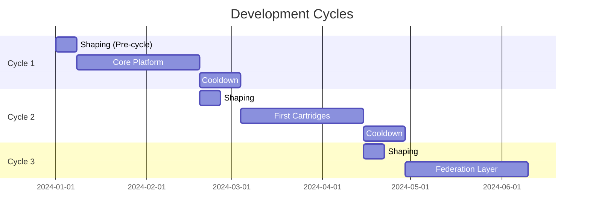
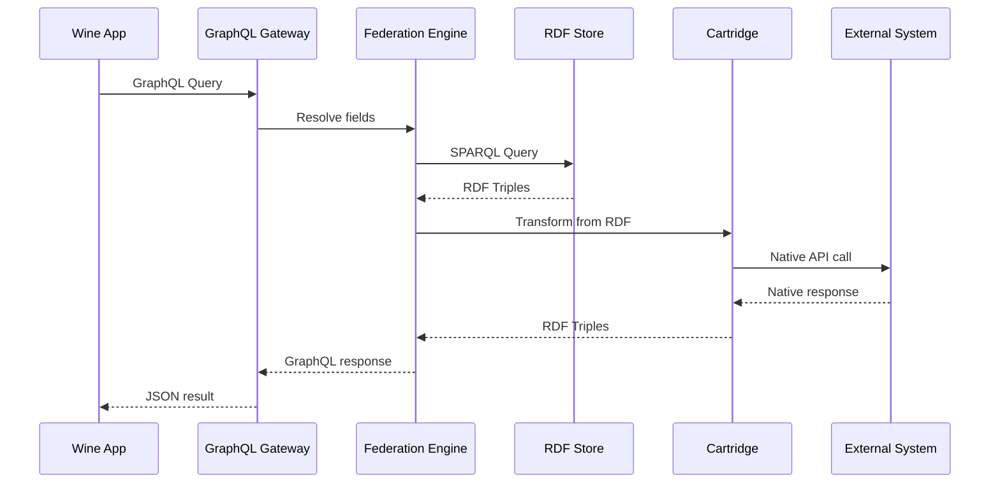
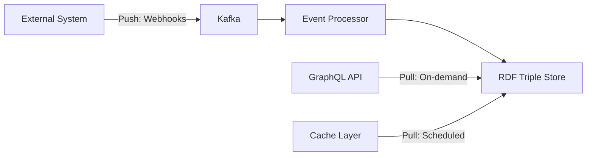

For a platform like Mycelium, I recommend a **Hybrid Approach**: Shape-Up methodology with BDD acceptance criteria. This combines strategic planning with implementation flexibility. Let me create a comprehensive Technical PRD with this approach.

# **Mycelium Technical Product Requirements Document**

## **Executive Summary**

Mycelium is a federated data infrastructure platform that enables seamless integration between wine service applications and restaurant systems through a GraphQL-first, RDF-powered schema mapping layer.

**Version:** 1.0.0  
**Status:** Draft  
**Last Updated:** [Current Date]

---

## **1. Product Vision & Strategy**

### **1.1 Problem Statement**
Restaurant technology systems are fragmented. Wine service apps need to integrate with dozens of POS, reservation, and payment systems, each with unique APIs, data models, and authentication mechanisms. This creates:
- 🔄 **Integration sprawl** - N×M connection problem
- 🔐 **Security risks** - API keys scattered across applications
- 📊 **Data silos** - No unified guest view across venues
- 💸 **High costs** - Custom integrations for each system

### **1.2 Solution Overview**
Mycelium provides a unified federation layer that:
- **Normalizes** disparate schemas using RDF ontologies
- **Federates** data access through GraphQL
- **Secures** credentials in a centralized vault
- **Scales** through a cartridge-based plugin system

### **1.3 Success Metrics**

| Metric | Target | Measurement |
|--------|--------|------------|
| Integration Velocity | <5 days per new system | Time from start to production |
| Query Latency (P95) | <100ms | GraphQL response time |
| Event Processing Lag | <1 second | Kafka to RDF store |
| Tenant Onboarding | <30 minutes | Signup to first API call |
| System Uptime | 99.95% | Monthly availability |
| Cartridge Adoption | >10 cartridges in 6 months | Published cartridges |

---

## **2. Development Methodology**

### **2.1 Shape-Up Cycles**

We'll use **6-week cycles** with 2-week cooldowns:



### **2.2 BDD Structure**

Each feature follows this pattern:

```gherkin
Feature: [Cartridge Installation]
  As a [tenant administrator]
  I want to [install a Toast POS cartridge]
  So that [my wine app can access Toast data]

  Background:
    Given I have a valid tenant account
    And I have Toast API credentials

  Scenario: Successful cartridge installation
    Given the Toast cartridge is available in the registry
    When I provide valid Toast credentials
    And I map Toast locations to my venues
    Then the cartridge should be installed
    And Toast webhooks should be registered
    And GraphQL schema should be extended with Toast types

  Scenario: Invalid credentials handling
    Given the Toast cartridge is available
    When I provide invalid Toast credentials
    Then installation should fail with clear error
    And no partial state should remain
```

---

## **3. Technical Architecture**

### **3.1 System Architecture**

```yaml
# High-Level Architecture
components:
  edge:
    - GraphQL Gateway (Apollo Gateway)
    - REST Adapter (for legacy)
    - WebSocket Server (subscriptions)
  
  core:
    - Federation Engine (Node.js)
    - RDF Triple Store (Apache Jena Fuseki)
    - Event Processor (Kafka Streams)
    - Identity Resolver (UUID5 + Graph)
  
  storage:
    - PostgreSQL (tenant metadata)
    - Redis (cache + sessions)
    - Kafka (event streaming)
    - S3 (document storage)
  
  security:
    - HashiCorp Vault (secrets)
    - OAuth2/OIDC (authentication)
    - OPA (authorization policies)
```

### **3.2 Data Flow**



---

## **4. Implementation Roadmap**

### **Cycle 1: Foundation (Weeks 1-6)**

#### **Epic 1.1: Core Platform Setup**

<details>
<summary><b>User Story: Project Scaffolding</b></summary>

```gherkin
Feature: Development Environment
  As a developer
  I want a containerized development environment
  So that I can run Mycelium locally

  Scenario: Local development setup
    Given I have Docker installed
    When I run "docker-compose up"
    Then all services should start
    And health checks should pass
    And GraphQL playground should be accessible at localhost:4000

  Scenario: Hot reload development
    Given the environment is running
    When I modify source code
    Then services should automatically reload
    And changes should be reflected immediately
```

**Acceptance Criteria:**
- [ ] Docker Compose with all services
- [ ] Hot reload for Node.js services
- [ ] Automated health checks
- [ ] Seed data for testing
- [ ] Developer documentation

**Technical Tasks:**
```typescript
// Project structure to implement
mycelium/
├── docker-compose.yml
├── packages/
│   ├── @mycelium/core/
│   ├── @mycelium/federation/
│   └── @mycelium/cartridge-sdk/
├── services/
│   ├── gateway/
│   ├── federation/
│   └── event-processor/
└── infrastructure/
    ├── kafka/
    ├── postgres/
    └── redis/
```
</details>

<details>
<summary><b>User Story: RDF Triple Store</b></summary>

```gherkin
Feature: RDF Data Storage
  As a platform
  I need to store and query RDF triples
  So that I can map between different schemas

  Scenario: Store tenant data as RDF
    Given a tenant "restaurant-123"
    When I store diner data from Toast POS
    Then it should be converted to RDF triples
    And stored in tenant's named graph
    And be queryable via SPARQL

  Scenario: Federated SPARQL queries
    Given multiple tenants with data
    When I execute a federated SPARQL query
    Then results should aggregate across tenants
    And respect tenant isolation
```

**Acceptance Criteria:**
- [ ] Apache Jena Fuseki deployed
- [ ] Named graphs per tenant
- [ ] SPARQL endpoint secured
- [ ] RDF/JSON serialization
- [ ] Backup and restore procedures

**Implementation:**
```javascript
class RDFStore {
  async initialize() {
    this.connection = new FusekiConnection({
      endpoint: process.env.FUSEKI_ENDPOINT,
      username: process.env.FUSEKI_USER,
      password: process.env.FUSEKI_PASSWORD
    });
  }

  async createTenantGraph(tenantId) {
    const graphUri = `https://myceliumql.com/graphs/${tenantId}`;
    await this.connection.createNamedGraph(graphUri);
    return graphUri;
  }

  async storeTriples(tenantId, triples) {
    const graphUri = this.getTenantGraph(tenantId);
    const dataset = this.triplesToDataset(triples);
    await this.connection.putDataset(graphUri, dataset);
  }

  async queryTenant(tenantId, sparql) {
    const query = `
      PREFIX : <https://myceliumql.com/ontology/>
      SELECT * FROM <${this.getTenantGraph(tenantId)}>
      WHERE { ${sparql} }
    `;
    return await this.connection.query(query);
  }
}
```
</details>

<details>
<summary><b>User Story: Event Sourcing Infrastructure</b></summary>

```gherkin
Feature: Event Sourcing
  As a platform
  I need to capture all state changes as events
  So that I have an audit trail and can replay state

  Scenario: Capture domain events
    Given a diner updates their preferences
    When the change is processed
    Then a PreferencesUpdated event should be created
    And stored in Kafka
    And projected to RDF store

  Scenario: Event replay
    Given a corrupted projection
    When I replay events from timestamp
    Then state should be reconstructed
    And projections should be consistent
```

**Acceptance Criteria:**
- [ ] Kafka cluster with 3 brokers
- [ ] Event schema registry (Avro)
- [ ] Event store abstraction
- [ ] Replay mechanism
- [ ] Monitoring and alerting

**Code Structure:**
```javascript
// Event definition
class PreferencesUpdatedEvent extends DomainEvent {
  static schema = {
    type: 'record',
    name: 'PreferencesUpdated',
    fields: [
      { name: 'dinerId', type: 'string' },
      { name: 'preferences', type: 'record', fields: [
        { name: 'glassware', type: ['null', 'string'], default: null },
        { name: 'temperature', type: ['null', 'string'], default: null },
        { name: 'decantTime', type: ['null', 'int'], default: null }
      ]}
    ]
  };

  constructor(dinerId, preferences) {
    super('Diner', dinerId);
    this.data = { dinerId, preferences };
  }

  toRDF() {
    return [
      { s: `diner:${this.dinerId}`, p: 'hasPreference', o: `pref:${this.id}` },
      { s: `pref:${this.id}`, p: 'glassware', o: this.data.preferences.glassware },
      { s: `pref:${this.id}`, p: 'temperature', o: this.data.preferences.temperature }
    ];
  }
}
```
</details>

#### **Epic 1.2: Identity Resolution System**

<details>
<summary><b>User Story: Deterministic ID Generation</b></summary>

```gherkin
Feature: Identity Resolution
  As a platform
  I need to generate consistent IDs across systems
  So that I can track entities across integrations

  Scenario: Generate deterministic diner ID
    Given a diner with email "john@example.com"
    And phone "+1-555-0123"
    When I generate their ID from any system
    Then it should always produce the same UUID5
    And handle normalization consistently

  Scenario: Identity merging
    Given two diner records that are the same person
    When I discover they share an email
    Then their identities should be merged
    And history should be preserved
```

**Acceptance Criteria:**
- [ ] UUID5 generation with namespaces
- [ ] Email/phone normalization rules
- [ ] Identity graph in RDF
- [ ] Merge conflict resolution
- [ ] Identity change history

**Implementation:**
```javascript
class IdentityResolver {
  constructor() {
    this.namespaces = {
      diner: 'f47ac10b-58cc-4372-a567-0e02b2c3d479',
      venue: '6ba7b810-9dad-11d1-80b4-00c04fd430c8',
      staff: '6ba7b811-9dad-11d1-80b4-00c04fd430c9'
    };
  }

  generateDinerId(identifiers) {
    const normalized = this.normalizeIdentifiers(identifiers);
    const composite = [
      normalized.email,
      normalized.phone,
      normalized.externalIds?.stripeCustomerId
    ].filter(Boolean).sort().join('|');
    
    return uuidv5(composite, this.namespaces.diner);
  }

  normalizeIdentifiers(identifiers) {
    return {
      email: identifiers.email?.toLowerCase().trim(),
      phone: this.normalizePhone(identifiers.phone),
      externalIds: identifiers.externalIds
    };
  }

  normalizePhone(phone) {
    if (!phone) return null;
    // Strip all non-digits
    const digits = phone.replace(/\D/g, '');
    // Add country code if missing (US default)
    return digits.length === 10 ? `1${digits}` : digits;
  }

  async mergeIdentities(primaryId, secondaryId) {
    const event = new IdentitiesMergedEvent(primaryId, secondaryId);
    await this.eventStore.append(event);
    
    // Update RDF graph
    const triples = [
      { s: `id:${secondaryId}`, p: 'owl:sameAs', o: `id:${primaryId}` },
      { s: `id:${primaryId}`, p: 'merged:at', o: new Date().toISOString() }
    ];
    await this.rdfStore.storeTriples(triples);
  }
}
```
</details>

### **Cycle 2: Cartridge System (Weeks 7-12)**

#### **Epic 2.1: Cartridge SDK**

<details>
<summary><b>User Story: Cartridge Development Kit</b></summary>

```gherkin
Feature: Cartridge SDK
  As a developer
  I want to create custom cartridges
  So that I can integrate new systems

  Scenario: Create Toast POS cartridge
    Given the Cartridge SDK
    When I implement the Toast integration
    Then I should define RDF mappings
    And GraphQL schema extensions
    And webhook handlers
    And the cartridge should be packageable

  Scenario: Test cartridge locally
    Given a cartridge in development
    When I run the test harness
    Then it should mock external APIs
    And validate RDF mappings
    And test GraphQL resolvers
```

**Acceptance Criteria:**
- [ ] TypeScript SDK with interfaces
- [ ] CLI for scaffolding
- [ ] Testing utilities
- [ ] Documentation generator
- [ ] Publishing workflow

**SDK Structure:**
```typescript
// Cartridge SDK
import { Cartridge, Schema, Mapping } from '@mycelium/cartridge-sdk';

@Cartridge({
  id: 'toast-pos',
  version: '1.0.0',
  name: 'Toast POS Integration',
  author: 'Mycelium Team'
})
export class ToastCartridge extends BaseCartridge {
  
  @Schema()
  ontology = `
    @prefix toast: <https://myceliumql.com/toast/> .
    @prefix core: <https://myceliumql.com/core/> .
    
    toast:Guest rdfs:subClassOf core:Diner .
    toast:Check rdfs:subClassOf core:Order .
  `;

  @Mapping({ from: 'toast:Guest', to: 'core:Diner' })
  mapGuest(toastGuest: any): RDFTriples {
    return [
      { s: `diner:${this.generateId(toastGuest)}`, 
        p: 'rdf:type', 
        o: 'core:Diner' },
      { s: `diner:${this.generateId(toastGuest)}`, 
        p: 'core:email', 
        o: toastGuest.email },
      { s: `diner:${this.generateId(toastGuest)}`, 
        p: 'core:phone', 
        o: toastGuest.phoneNumber }
    ];
  }

  @GraphQLExtension()
  schema = gql`
    extend type Diner {
      toastId: String
      toastLoyaltyPoints: Int
      toastOrders: [ToastOrder]
    }
    
    type ToastOrder {
      id: String!
      checkNumber: String
      total: Float
      items: [ToastItem]
    }
  `;

  @Resolver('Diner.toastOrders')
  async resolveToastOrders(diner: any) {
    const toastApi = await this.getApiClient();
    return toastApi.getGuestOrders(diner.toastId);
  }

  @WebhookHandler('order.closed')
  async handleOrderClosed(payload: any) {
    const event = new OrderClosedEvent(payload);
    await this.publishEvent(event);
    
    const triples = this.mapOrder(payload);
    await this.storeTriples(triples);
  }
}
```
</details>

<details>
<summary><b>User Story: Cartridge Registry</b></summary>

```gherkin
Feature: Cartridge Registry
  As a tenant admin
  I want to browse available cartridges
  So that I can install integrations

  Scenario: Browse cartridge registry
    Given published cartridges in registry
    When I search for "POS"
    Then I should see Toast, Square, and Clover cartridges
    And each should show capabilities
    And installation requirements

  Scenario: Install cartridge
    Given I selected Toast cartridge
    When I provide configuration
    And approve permissions
    Then cartridge should be installed
    And schema should be extended
    And webhooks should be registered
```

**Registry Implementation:**
```javascript
class CartridgeRegistry {
  async publish(cartridge, metadata) {
    // Validate cartridge
    await this.validateCartridge(cartridge);
    
    // Store in registry
    await this.db.cartridges.create({
      id: cartridge.id,
      version: cartridge.version,
      metadata: {
        ...metadata,
        schema: cartridge.ontology,
        graphql: cartridge.schema,
        capabilities: cartridge.capabilities,
        configSchema: cartridge.configSchema
      },
      package: {
        url: `s3://cartridges/${cartridge.id}-${cartridge.version}.tar.gz`,
        checksum: await this.calculateChecksum(cartridge)
      }
    });
    
    // Update search index
    await this.updateSearchIndex(cartridge);
  }

  async install(tenantId, cartridgeId, config) {
    const cartridge = await this.loadCartridge(cartridgeId);
    
    // Validate configuration
    await cartridge.validateConfig(config);
    
    // Store tenant configuration
    await this.vault.write(
      `tenants/${tenantId}/cartridges/${cartridgeId}`,
      config
    );
    
    // Initialize cartridge
    await cartridge.initialize(tenantId, config);
    
    // Extend GraphQL schema
    await this.federation.extendSchema(tenantId, cartridge.schema);
    
    // Register webhooks
    await cartridge.registerWebhooks(tenantId);
    
    return { success: true, cartridgeId };
  }
}
```
</details>

### **Cycle 3: Federation Layer (Weeks 13-18)**

#### **Epic 3.1: GraphQL Federation**

<details>
<summary><b>User Story: Federated GraphQL Gateway</b></summary>

```gherkin
Feature: GraphQL Federation
  As an API consumer
  I want a unified GraphQL API
  So that I can query across all integrated systems

  Scenario: Query across multiple systems
    Given Toast POS and Stripe cartridges installed
    When I query for diner with orders and payments
    Then data should federate from both systems
    And be returned in single response
    And respect field-level permissions

  Scenario: Real-time subscriptions
    Given subscription to order updates
    When new order created in Toast
    Then GraphQL subscription should fire
    And client should receive update
```

**Federation Setup:**
```javascript
import { ApolloGateway, RemoteGraphQLDataSource } from '@apollo/gateway';
import { ApolloServer } from 'apollo-server-express';

class FederationGateway {
  async initialize() {
    // Build service list from installed cartridges
    const services = await this.buildServiceList();
    
    this.gateway = new ApolloGateway({
      serviceList: services,
      buildService({ name, url }) {
        return new AuthenticatedDataSource({ url });
      },
      experimental_updateServiceDefinitions: async (config) => {
        // Dynamic schema updates when cartridges change
        const services = await this.buildServiceList();
        return { services, isNewSchema: true };
      }
    });

    this.server = new ApolloServer({
      gateway: this.gateway,
      subscriptions: {
        'graphql-ws': {
          onConnect: async (ctx) => {
            const token = ctx.connectionParams.authorization;
            const tenant = await this.authenticateTenant(token);
            return { tenant };
          }
        }
      },
      context: ({ req }) => {
        return {
          tenant: req.tenant,
          user: req.user,
          dataSources: this.getDataSources(req.tenant)
        };
      }
    });
  }

  async buildServiceList() {
    const tenants = await this.getTenants();
    const services = [];
    
    for (const tenant of tenants) {
      const cartridges = await this.getCartridges(tenant.id);
      
      for (const cartridge of cartridges) {
        services.push({
          name: `${tenant.id}-${cartridge.id}`,
          url: `http://federation:4001/${tenant.id}/${cartridge.id}`
        });
      }
    }
    
    return services;
  }
}

class AuthenticatedDataSource extends RemoteGraphQLDataSource {
  willSendRequest({ request, context }) {
    request.http.headers.set('x-tenant-id', context.tenant.id);
    request.http.headers.set('x-user-id', context.user.id);
  }
}
```
</details>

#### **Epic 3.2: SPARQL to GraphQL Bridge**

<details>
<summary><b>User Story: Query Translation</b></summary>

```gherkin
Feature: SPARQL to GraphQL Translation
  As the federation engine
  I need to translate between GraphQL and SPARQL
  So that I can query RDF data via GraphQL

  Scenario: Translate GraphQL to SPARQL
    Given a GraphQL query for diners
    When federation engine processes it
    Then it should generate SPARQL query
    And execute against RDF store
    And transform results back to GraphQL

  Scenario: Optimize query execution
    Given a complex nested GraphQL query
    When translated to SPARQL
    Then it should use efficient patterns
    And batch similar queries
    And cache frequent queries
```

**Translation Engine:**
```javascript
class SPARQLTranslator {
  translateQuery(graphqlQuery, schema) {
    const ast = parse(graphqlQuery);
    const info = this.analyzeQuery(ast, schema);
    
    return this.buildSPARQL(info);
  }

  buildSPARQL(queryInfo) {
    const { selections, variables, fragments } = queryInfo;
    
    let sparql = `
      PREFIX core: <https://myceliumql.com/core/>
      PREFIX rdf: <http://www.w3.org/1999/02/22-rdf-syntax-ns#>
      
      SELECT ${this.buildProjections(selections)}
      WHERE {
        ${this.buildPatterns(selections)}
        ${this.buildFilters(variables)}
      }
      ${this.buildModifiers(queryInfo)}
    `;
    
    return this.optimizeSPARQL(sparql);
  }

  buildPatterns(selections) {
    return selections.map(sel => {
      const subject = `?${sel.alias || sel.name}`;
      const predicate = this.mapFieldToPredicate(sel.name);
      const object = sel.selections 
        ? `?${sel.name}_value`
        : `?${sel.name}`;
      
      return `${subject} ${predicate} ${object} .`;
    }).join('\n');
  }

  async executeAndTransform(sparql, tenantId) {
    const results = await this.rdfStore.query(tenantId, sparql);
    return this.transformToGraphQL(results);
  }

  transformToGraphQL(sparqlResults) {
    // Convert SPARQL JSON results to GraphQL response format
    const transformed = {};
    
    for (const binding of sparqlResults.results.bindings) {
      for (const [key, value] of Object.entries(binding)) {
        const fieldName = this.extractFieldName(key);
        transformed[fieldName] = this.convertValue(value);
      }
    }
    
    return transformed;
  }
}
```
</details>

---

## **5. Testing Strategy**

### **5.1 Test Pyramid**

```yaml
test_distribution:
  unit_tests: 70%
    - Pure functions
    - RDF transformations
    - Identity resolution
    
  integration_tests: 20%
    - Cartridge installation
    - GraphQL federation
    - Event processing
    
  e2e_tests: 10%
    - Complete user journeys
    - Multi-tenant scenarios
    - Performance benchmarks
```

### **5.2 BDD Test Implementation**

```javascript
// Cucumber test example
const { Given, When, Then } = require('@cucumber/cucumber');
const { expect } = require('chai');

Given('a tenant {string} with {string} cartridge', async function(tenantId, cartridgeName) {
  this.tenant = await this.testFactory.createTenant(tenantId);
  this.cartridge = await this.registry.install(tenantId, cartridgeName, {
    apiKey: 'test-key',
    apiSecret: 'test-secret'
  });
});

When('I query for diner {string}', async function(dinerId) {
  const query = `
    query GetDiner($id: ID!) {
      diner(id: $id) {
        id
        email
        preferences {
          glassware
          temperature
        }
      }
    }
  `;
  
  this.response = await this.graphqlClient.query({
    query,
    variables: { id: dinerId }
  });
});

Then('I should receive diner data from {string}', async function(source) {
  expect(this.response.data.diner).to.exist;
  expect(this.response.extensions.dataSources).to.include(source);
});
```

---

## **6. Performance Requirements**

### **6.1 Benchmarks**

| Operation | Target | Degraded | Unacceptable |
|-----------|--------|----------|--------------|
| GraphQL query (simple) | <50ms | <200ms | >500ms |
| GraphQL query (federated) | <100ms | <500ms | >1s |
| Event processing | <500ms | <2s | >5s |
| Cartridge installation | <30s | <2m | >5m |
| SPARQL query (simple) | <20ms | <100ms | >500ms |
| Identity resolution | <10ms | <50ms | >100ms |

### **6.2 Load Testing Scenarios**

```javascript
// K6 load test
import http from 'k6/http';
import { check, sleep } from 'k6';

export const options = {
  stages: [
    { duration: '2m', target: 100 }, // Ramp up
    { duration: '5m', target: 100 }, // Stay at 100 users
    { duration: '2m', target: 200 }, // Spike
    { duration: '5m', target: 200 }, // Stay at 200
    { duration: '2m', target: 0 },   // Ramp down
  ],
  thresholds: {
    http_req_duration: ['p(95)<100'], // 95% of requests under 100ms
    http_req_failed: ['rate<0.01'],   // Error rate under 1%
  },
};

export default function() {
  const query = `
    query { 
      diners(first: 10) { 
        edges { 
          node { id email } 
        } 
      } 
    }
  `;

  const response = http.post(
    'http://localhost:4000/graphql',
    JSON.stringify({ query }),
    { headers: { 'Content-Type': 'application/json' } }
  );

  check(response, {
    'status is 200': (r) => r.status === 200,
    'response time < 100ms': (r) => r.timings.duration < 100,
  });

  sleep(1);
}
```

---

## **7. Security Requirements**

### **7.1 Authentication & Authorization**

```yaml
security_layers:
  authentication:
    - OAuth2/OIDC for users
    - API keys for service-to-service
    - JWT tokens with refresh
    
  authorization:
    - OPA policies for fine-grained control
    - Row-level security in RDF
    - Field-level GraphQL permissions
    
  secrets_management:
    - HashiCorp Vault for credentials
    - Encryption at rest (AES-256)
    - TLS 1.3 for transit
```

### **7.2 Compliance Requirements**

- **PCI DSS** - No credit card data stored
- **GDPR** - Right to deletion, data portability
- **CCPA** - California privacy compliance
- **SOC2** - Audit trails, access controls

---

## **8. Monitoring & Observability**

### **8.1 Metrics Collection**

```javascript
// Prometheus metrics
const promClient = require('prom-client');

const metrics = {
  graphqlDuration: new promClient.Histogram({
    name: 'graphql_query_duration_seconds',
    help: 'GraphQL query execution time',
    labelNames: ['operation', 'tenant', 'cartridge'],
    buckets: [0.01, 0.05, 0.1, 0.5, 1, 5]
  }),
  
  cartridgeInstalls: new promClient.Counter({
    name: 'cartridge_installs_total',
    help: 'Total cartridge installations',
    labelNames: ['cartridge', 'status']
  }),
  
  rdfTriples: new promClient.Gauge({
    name: 'rdf_triples_total',
    help: 'Total RDF triples stored',
    labelNames: ['tenant']
  })
};
```

### **8.2 Distributed Tracing**

```javascript
// OpenTelemetry setup
const { NodeTracerProvider } = require('@opentelemetry/node');
const { registerInstrumentations } = require('@opentelemetry/instrumentation');

const provider = new NodeTracerProvider();
provider.register();

registerInstrumentations({
  instrumentations: [
    new GraphQLInstrumentation(),
    new KafkaInstrumentation(),
    new HTTPInstrumentation()
  ]
});
```

---

## **9. Risk Assessment & Mitigation**

| Risk | Probability | Impact | Mitigation |
|------|-------------|--------|------------|
| RDF query performance degradation | Medium | High | Implement materialized views, caching layer |
| Cartridge compatibility issues | High | Medium | Comprehensive testing framework, versioning |
| Multi-tenant data leakage | Low | Critical | Row-level security, penetration testing |
| External API rate limiting | High | Medium | Circuit breakers, request queuing |
| Event processing bottlenecks | Medium | High | Horizontal scaling, backpressure handling |

---

## **10. Success Criteria & Acceptance**

### **Definition of Done**

- [ ] All BDD scenarios pass
- [ ] Code coverage >80%
- [ ] Performance benchmarks met
- [ ] Security scan passed
- [ ] Documentation complete
- [ ] Deployed to staging
- [ ] Monitoring configured
- [ ] Rollback plan tested

### **Release Criteria**

- [ ] 3 pilot restaurants onboarded
- [ ] 10,000 successful API calls
- [ ] Zero critical security issues
- [ ] <1% error rate in production
- [ ] Disaster recovery tested

---

## **Appendix A: Technical Decisions Log**

| Decision | Choice | Rationale | Date |
|----------|--------|-----------|------|
| Schema mapping | RDF/SPARQL | Flexibility for heterogeneous schemas | [Date] |
| API Layer | GraphQL Federation | Better than REST for complex relationships | [Date] |
| Event bus | Kafka | Proven scale, ecosystem | [Date] |
| Container orchestration | Docker/K8s | Industry standard | [Date] |
| Development methodology | Shape-Up + BDD | Balance of planning and agility | [Date] |

---

## **Appendix B: Glossary**

- **Cartridge**: Plugin module for integrating external systems
- **Federation**: Combining multiple data sources into unified API
- **RDF**: Resource Description Framework for semantic data
- **SPARQL**: Query language for RDF data
- **Named Graph**: Tenant-isolated RDF dataset
- **UUID5**: Deterministic UUID generation algorithm

---
Excellent technical choices! Let me help you work through the remaining architectural decisions with your RDF-based schema mapping approach.

## **RDF Schema Mapping Architecture**

Your RDF approach for schema mapping is sophisticated. Here's how to structure it:

### **Cartridge System Design**

```typescript
// Core cartridge interface
interface MyceliumCartridge {
  namespace: string;  // e.g., "toast", "stripe", "mycelium.core"
  ontology: RDFSchema;
  
  // Bidirectional mappings
  toRDF(sourceData: any): RDFTriples;
  fromRDF(triples: RDFTriples): any;
  
  // GraphQL schema contribution
  getGraphQLTypeDefs(): DocumentNode;
  getResolvers(): IResolvers;
}

// Example: Toast POS cartridge
class ToastCartridge implements MyceliumCartridge {
  namespace = "toast";
  
  ontology = {
    prefixes: {
      toast: "https://myceliumql.com/ontology/toast/",
      core: "https://myceliumql.com/ontology/core/"
    },
    mappings: [
      // Map Toast's "guest" to core "diner"
      { 
        subject: "toast:guest",
        predicate: "owl:sameAs",
        object: "core:diner"
      }
    ]
  };
}
```

### **RDF Triple Store Architecture**

```javascript
// Using Apache Jena or Blazegraph for RDF storage
const tripleStore = {
  // Each tenant gets their own named graph
  tenantGraph: (tenantId) => `https://myceliumql.com/graphs/${tenantId}`,
  
  // Shared ontologies across all tenants
  ontologyGraph: "https://myceliumql.com/ontology",
  
  // SPARQL federation across tenant graphs
  federatedQuery: async (sparql, tenantIds) => {
    return await blazegraph.query({
      query: sparql,
      defaultGraphs: tenantIds.map(id => tripleStore.tenantGraph(id))
    });
  }
};
```

## **Push vs. Pull Federation Decision**

For your use case, I recommend **Hybrid Push-Pull**:



**Decision Matrix:**
- **Push for**: Real-time events (orders, payments, reservations)
- **Pull for**: Reference data (wine lists, menus, restaurant info)
- **Cache strategy**: Pull frequently-accessed data into Redis Graph

## **Identity Resolution Architecture**

### **UUID5 Approach (Recommended)**

```javascript
// Deterministic ID generation using UUID5
const generateDeterministicId = (namespace, ...components) => {
  // Sort components for consistency
  const normalized = components
    .map(c => c?.toLowerCase().trim())
    .filter(Boolean)
    .sort()
    .join('|');
    
  return uuidv5(normalized, namespace);
};

// Example: Same person across systems
const dinerId = generateDeterministicId(
  DINER_NAMESPACE,
  email || null,
  phoneNumber || null,
  stripCustomerId || null
);
```

**Benefits:**
- Idempotent (same inputs = same ID)
- No central ID service required
- Works offline/distributed

**Tradeoffs:**
- Can't handle fuzzy matching
- Requires careful normalization

### **Handling Email/Phone Changes**

```javascript
// Identity Evolution Graph (stored as RDF)
class IdentityGraph {
  // Track identity changes over time
  recordIdentityChange(oldId, newId, reason, timestamp) {
    const triples = [
      // Link old to new
      { s: oldId, p: "identity:supersededBy", o: newId },
      { s: newId, p: "identity:supersedes", o: oldId },
      // Record metadata
      { s: newId, p: "identity:changeReason", o: reason },
      { s: newId, p: "identity:changedAt", o: timestamp }
    ];
    
    // Keep both IDs active for grace period
    this.addGracePeriodMapping(oldId, newId, "30d");
  }
  
  // Query current identity
  async getCurrentIdentity(anyId) {
    const sparql = `
      SELECT ?currentId WHERE {
        ?anyId identity:supersededBy* ?currentId .
        FILTER NOT EXISTS {
          ?currentId identity:supersededBy ?newer
        }
      }
    `;
    return await this.query(sparql, { anyId });
  }
}
```

## **Event Sourcing vs. Debezium Decision**

For your architecture, I recommend **Event Sourcing** as primary with Debezium for legacy integrations:

### **Event Sourcing Architecture**

```javascript
// Core event structure
class DomainEvent {
  constructor(aggregate, type, data) {
    this.id = uuidv4();
    this.aggregateId = aggregate.id;
    this.aggregateType = aggregate.type;
    this.eventType = type;
    this.eventVersion = 1;
    this.timestamp = new Date().toISOString();
    this.data = data;
    
    // RDF representation
    this.toRDF = () => ({
      subject: `event:${this.id}`,
      predicates: {
        "event:aggregate": this.aggregateId,
        "event:type": this.eventType,
        "event:timestamp": this.timestamp,
        "event:data": JSON.stringify(this.data)
      }
    });
  }
}

// Event store with Kafka
class EventStore {
  async append(event) {
    // Write to Kafka for streaming
    await kafka.producer.send({
      topic: `events.${event.aggregateType}`,
      messages: [{
        key: event.aggregateId,
        value: JSON.stringify(event),
        headers: {
          'event-type': event.eventType,
          'tenant-id': this.tenantId
        }
      }]
    });
    
    // Also write to RDF for querying
    await this.tripleStore.insert(event.toRDF());
  }
  
  async getEvents(aggregateId, fromVersion = 0) {
    // Read from RDF store for replay
    const sparql = `
      SELECT ?event WHERE {
        ?event event:aggregate "${aggregateId}" .
        ?event event:version ?v .
        FILTER(?v >= ${fromVersion})
      } ORDER BY ?v
    `;
    return await this.query(sparql);
  }
}
```

### **Debezium for Legacy Systems**

```yaml
# Use Debezium only for systems you don't control
debezium_connectors:
  toast_pos:
    type: mysql
    tables:
      - orders
      - guests
    transforms:
      - type: "event_bridge"
        target: "kafka"
        topic: "external.toast.cdc"
```

## **Eventual Consistency Strategy**

Yes, design for eventual consistency from day one:

### **Consistency Model**

```javascript
// Saga pattern for distributed transactions
class ReservationSaga {
  constructor(sagaId, tenantId) {
    this.steps = [
      { service: 'inventory', action: 'reserve', compensate: 'release' },
      { service: 'payment', action: 'authorize', compensate: 'void' },
      { service: 'notification', action: 'send', compensate: null }
    ];
  }
  
  async execute(context) {
    const executed = [];
    
    try {
      for (const step of this.steps) {
        await this.executeStep(step, context);
        executed.push(step);
      }
    } catch (error) {
      // Compensate in reverse order
      for (const step of executed.reverse()) {
        if (step.compensate) {
          await this.compensateStep(step, context);
        }
      }
      throw error;
    }
  }
}

// CQRS with separate read/write models
const architecture = {
  write: {
    // Commands go through event sourcing
    handler: CommandHandler,
    storage: EventStore,
    consistency: 'strong'
  },
  read: {
    // Queries use eventually consistent projections
    handler: QueryHandler,
    storage: GraphDatabase,
    consistency: 'eventual',
    lag: '< 1 second typical'
  }
};
```

### **Conflict Resolution**

```javascript
// Vector clocks for distributed updates
class VectorClock {
  merge(localClock, remoteClock) {
    // Last-write-wins with vector comparison
    const merged = {};
    const allNodes = new Set([
      ...Object.keys(localClock),
      ...Object.keys(remoteClock)
    ]);
    
    for (const node of allNodes) {
      merged[node] = Math.max(
        localClock[node] || 0,
        remoteClock[node] || 0
      );
    }
    return merged;
  }
}
```

## **Practical Implementation Path**

### **Phase 1: Foundation (Weeks 1-4)**

```javascript
// 1. Set up modular monolith structure
mycelium/
  ├── packages/
  │   ├── core/           # Shared types, utils
  │   ├── federation/      # GraphQL federation
  │   ├── identity/        # Identity resolution
  │   ├── events/          # Event sourcing
  │   └── cartridges/      # Cartridge system
  ├── services/
  │   ├── gateway/         # GraphQL gateway
  │   ├── processor/       # Event processor
  │   └── scheduler/       # Pull federation scheduler
  └── docker-compose.yml   # Local dev environment

// 2. Core schema definition
const CoreOntology = `
  @prefix core: <https://myceliumql.com/ontology/core/> .
  @prefix rdfs: <http://www.w3.org/2000/01/rdf-schema#> .
  
  core:Diner a rdfs:Class ;
    rdfs:label "Restaurant Guest" .
    
  core:Preference a rdfs:Class ;
    rdfs:label "Service Preference" .
    
  core:Reservation a rdfs:Class ;
    rdfs:label "Booking Record" .
`;
```

### **Phase 2: First Cartridge (Weeks 5-8)**

```javascript
// Stripe cartridge as proof of concept
class StripeCartridge {
  async initialize(tenant) {
    // Store API keys in vault
    await vault.write(`tenants/${tenant.id}/stripe`, {
      publishableKey: tenant.stripePublishableKey,
      secretKey: tenant.stripeSecretKey
    });
    
    // Register webhook endpoint
    await stripe.webhooks.create({
      url: `https://api.myceliumql.com/webhooks/stripe/${tenant.id}`,
      events: ['payment_intent.succeeded', 'charge.failed']
    });
    
    // Set up GraphQL schema extension
    this.extendSchema();
  }
  
  extendSchema() {
    return gql`
      extend type Diner {
        stripeCustomerId: String
        paymentMethods: [PaymentMethod]
      }
      
      type PaymentMethod {
        id: String!
        last4: String
        brand: String
      }
    `;
  }
}
```

### **Phase 3: Multi-tenant Federation (Weeks 9-12)**

```javascript
// Tenant isolation with schema-per-tenant
class TenantManager {
  async provisionTenant(tenant) {
    // 1. Create Kafka topics
    await kafka.admin.createTopics({
      topics: [
        `${tenant.id}.events`,
        `${tenant.id}.commands`
      ]
    });
    
    // 2. Create RDF named graph
    await tripleStore.createGraph(
      `https://myceliumql.com/graphs/${tenant.id}`
    );
    
    // 3. Initialize cartridges
    for (const cartridge of tenant.cartridges) {
      await this.installCartridge(tenant.id, cartridge);
    }
  }
}
```

## **Key Technical Decisions Summary**

✅ **Use Event Sourcing** for audit trail and replay capability
✅ **UUID5** for deterministic IDs with careful normalization
✅ **Hybrid Push-Pull** federation (push for events, pull for reference data)
✅ **Design for eventual consistency** with sagas and CQRS
✅ **Track identity changes** in RDF graph with temporal relationships
✅ **Schema-per-tenant** with federated GraphQL queries

## **Critical Early Implementation Focus**

1. **Get RDF mappings right early** - they're hard to change later
2. **Build comprehensive testing for cartridges** - mock every external system
3. **Implement idempotency everywhere** - especially webhook handlers
4. **Set up distributed tracing** (Jaeger/Zipkin) from day one
5. **Create tenant provisioning automation** - manual provisioning doesn't scale
